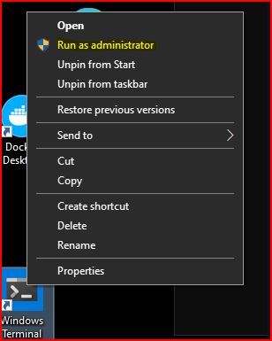

# TCPDump

In this lab we will be looking at some basic tcpdump filters every SOC and security analyst should know.

Let’s get started by opening a Terminal as Administrator

When you get the User Account Control Prompt, select Yes.

And then, open a Ubuntu command prompt:

![[Pasted image 20240206024117.png]]

We are going to start with a very basic filter that simply shows us the data associated with a specific host.

But first, let's get to the correct directory

$ `cd /mnt/c/Users/adhd`

The filter for this...  is host.

$ `tcpdump -n -r magnitude_1hr.pcap host 192.168.99.52`

For this command we are telling tcpdump to not resolve hostnames (-n) and we are telling it to read in the data from a file (-r).

![[Pasted image 20240206024536.png]]

What exactly is this showing us?

Well, it is showing each packet's timestamp:

![[Pasted image 20240206024618.png]]

Its protocol:

![[Pasted image 20240206024655.png]]

Its source IP address/port direction and destination IP address/port :

![[Pasted image 20240206024735.png]]

Its control bit flags and sequence numbers:

![[Pasted image 20240206024850.png]]

And data size:

![[Pasted image 20240206024918.png]]

But we can get the filter to be a bit more granular.  In fact, you can create filters for literally every part of a packet!

Let's add port number.

$` tcpdump -n -r magnitude_1hr.pcap host 192.168.99.52 and port 80`

You can hit ctrl+c after a few seconds:

![[Pasted image 20240206025052.png]]

In the screenshot above you can see we now have all the packets that are either sent or received by port 80 on 192.168.99.52.

While getting the overall metadata from the packets is nice, we can get the full ASCII decode of the packet and the payload of the packet.

$`tcpdump -n -r magnitude_1hr.pcap host 192.168.99.52 and port 80 -A`

![[Pasted image 20240206025203.png]]

As you can see above, we now can see the actual http GET requests and the responses.  

Lets dig into the packet with the timestamp of 09:14:32.638609

![[Pasted image 20240206025406.png]]

Ouch, it looks like PowerShell!!!  A favorite of attackers and pentesters alike.  Further, it looks like there is Base64 data.

![[Pasted image 20240206025853.png]]

Still not enough?  We can also see the raw Hex, if that is your sort of thing, with the -X flag:

$`tcpdump -n -r magnitude_1hr.pcap host 192.168.99.52 and port 80 -AX`

![[Pasted image 20240206030216.png]]

We can also specify specific protocols of interest.

For example.

$ `tcpdump -n -r magnitude_1hr.pcap ip6`

![[Pasted image 20240206030316.png]]

This is showing all the ipv6 traffic.

We can also specify network ranges.  This is very useful when you are seeing traffic either to or from a range of IP addresses.  For example, this can help us answer questions like "are there any other systems talking to this IP address range?" 

Think of an attacker using multiple systems on a network range to disperse their C2 traffic.

$`tcpdump -n -r magnitude_1hr.pcap net 192.168.99.0/24`

#Going further

Want to play with some more pcaps?  Cool.

Please check out Malware of the Day from Active Countermeasures!

https://www.activecountermeasures.com/category/malware-of-the-day/

Below are some commands to download some of the capture files.  Try and run through the basic level analysis we just did with them.

`https://www.dropbox.com/s/zyqn3nn5ygfki59/teamviewer_1hr.pcap`

`https://www.activecountermeasures.com/pcap/apt1virtuallythere_1hr.pcap`

`https://www.dropbox.com/s/51uzphl1f3ca691/lateral_backup_c2_1hr.pcap`

`https://www.dropbox.com/s/bhgvpablx11u8yb/taidoor_1hr.pcap`

Here is a great resource to try some more options in TCPDump:

https://danielmiessler.com/study/tcpdump/
